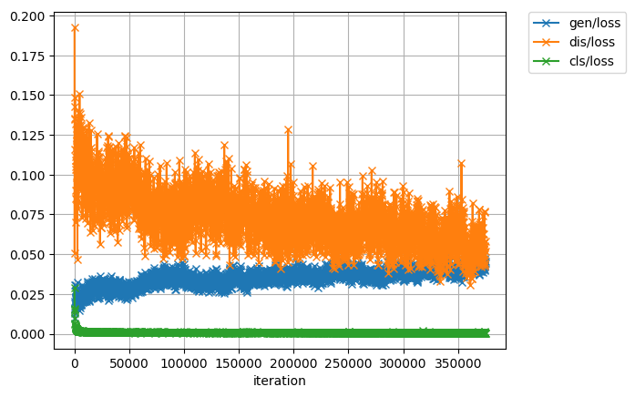

# chainer-PixelDA

This is an unofficial chainer re-implementation of a paper, Unsupervised Pixel-Level Domain Adaptation with Generative Adversarial Networks [Bousmalis+, CVPR2017].

## Requirements
- Python 3.5+
- Chainer 2.0+
- Numpy
- Matplotlib

## Performance on MNIST -> MNIST-M
Note that this is not reproduced perfectly.
Batchsize=32, #epoch=200.

| Method | Original [1] | Ours |
|:-:|:-:|:-:|
| Source-only | 63.6 % |  59.5 % |
| Target-only | 96.4 % |  95.9 % |
| PixelDA | 98.2 %  |  98.0 % |

## Usage

### Preprocess
Download MNIST-M dataset from [here](https://www.dropbox.com/s/mbv02veynifs8a4/mnistm_data.pkl?dl=0) (in .pkl format).

### Training source-only model (training on MNIST, test on MNIST-M)
```
python train.py source_only --gpu gpuno --out directory_out
```

### Training target-only model (training on MNIST-M, test on MNIST-M)
```
python train.py target_only --gpu gpuno --out directory_out
```

### Training PixelDA model (training on MNIST-M, test on MNIST-M)
```
python train_gan.py --gpu gpuno --out directory_out
```


Loss curve                 |  Accuracy
:-------------------------:|:-------------------------:
      |  

## References
- [1]: K. Bousmalis, et al. "Unsupervised Pixel-Level Domain Adaptation with Generative Adversarial Networks.", in CVPR, 2017.
- [2]: [Original implementation](https://github.com/tensorflow/models/tree/master/domain_adaptation) 
